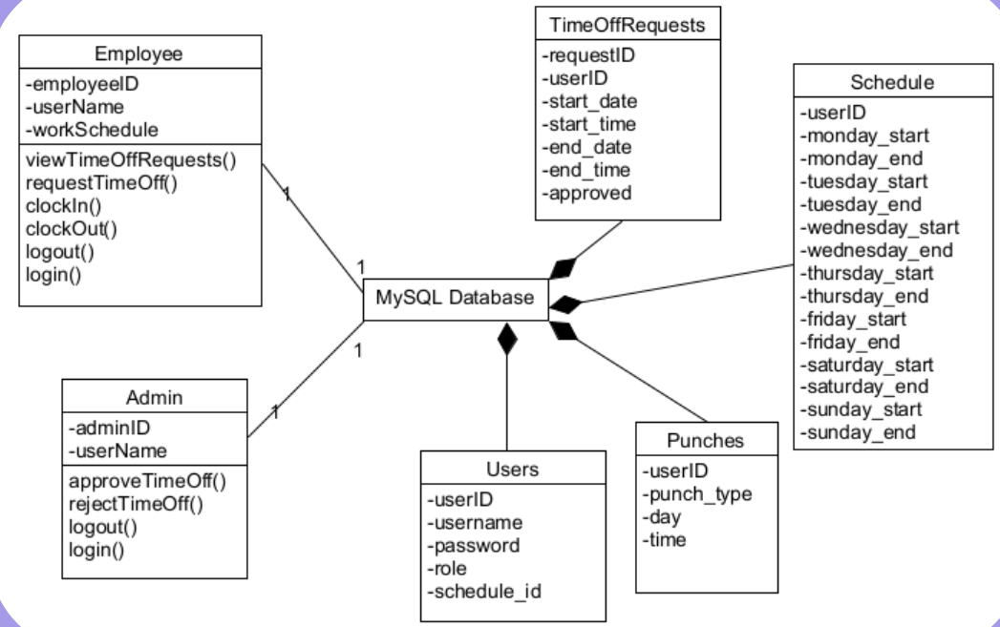
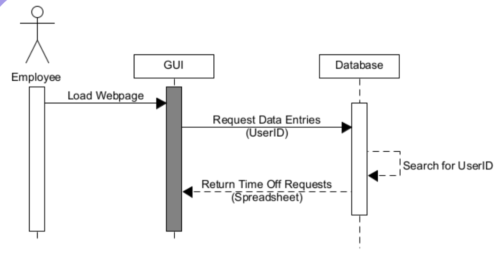
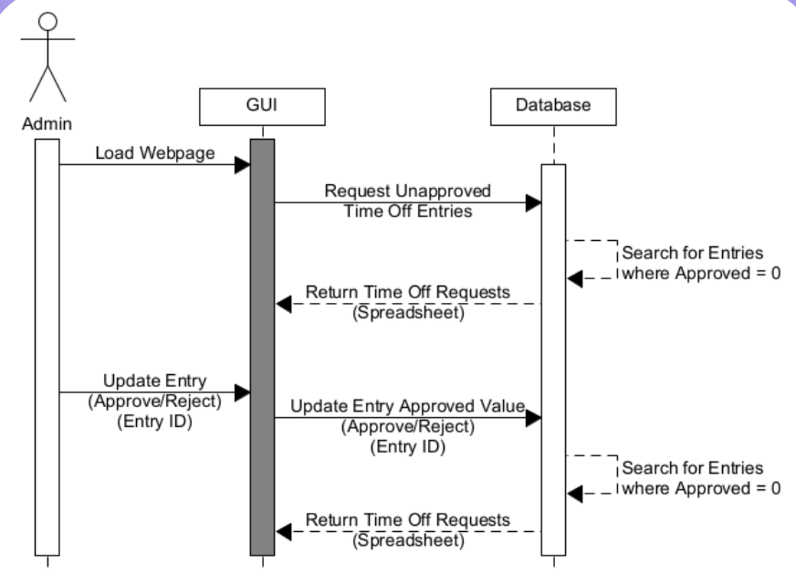

# COS 430 (Software Engineering): Term Project

    <strong>Group ID:</strong> G 02 
    <strong>Group Members:</strong> Mike, Nicholas, Nash 
    <strong>Project Title:</strong> Employee portal for clocking in/out, requesting time off, etc.  
    <strong>Project Description: Employee portal for clocking in/out, requesting time off, etc.</strong> ? 
    <strong>Application Type: web</strong>? 
 

## Executive Summary

Below, you will find a brief executive summary of our term project, including how the project will be relevant to end-users.

A web application for employees and admins of a company that allows them to do functionalities related to work/time management. This includes clocking in/out, requesting time off, and approving time off.

## Problem Statement

We created an Employee Portal for intuitive and easy clocking in and out of working hours for the purpose of a remote work environment. We paved a road to provide employees with a quick and simple way to submit a request for time off, and to view their previously submitted requests. We even made a personal Administrator Control Panel where managers can view, accept, and reject all employee submitted time off requests.

## Milestones and Timelines

#### Iteration #1
| Items        | Description              | Action Items and Deliverables                                                             |
|--------------|--------------------------|-------------------------------------------------------------------------------------------|
|  GUI  | Make a clear and concise graphical interface.                                                                             |
|    Login     | Be able to log in as an Employee or Admin and be directed to the respective pages.                                                                                                                                                         |

#### Iteration #2
| Items        | Description              | Action Items and Deliverables                                                             |
|--------------|--------------------------|-------------------------------------------------------------------------------------------|
| Clock in/out | Allow employees to clock in and out                                                                                  |
| Request Time Off | Allow employees to request time off                                                                              |

#### Iteration #3
| Items        | Description              | Action Items and Deliverables                                                             |
|--------------|--------------------------|-------------------------------------------------------------------------------------------|
| Approve Time Off | Allow admins to approve/reject time off requests                                                                 |
| GUI Update   | Updated the GUI to look good and consistent throughout the website                                                   |

## UML Diagrams
#### [1] Use Case Diagrams

Iteration 1:

Iteration 2:

Iteration 3:

#### [2] Class Diagrams

Iteration 1:

Iteration 2:

Iteration 3:

#### [3] Sequence Diagrams

Iteration 1:

Iteration 2:

Iteration 3:

#### [4] Deployment Diagrams

Iteration 1:

Iteration 2:

Iteration 3:

## References and Further Information
